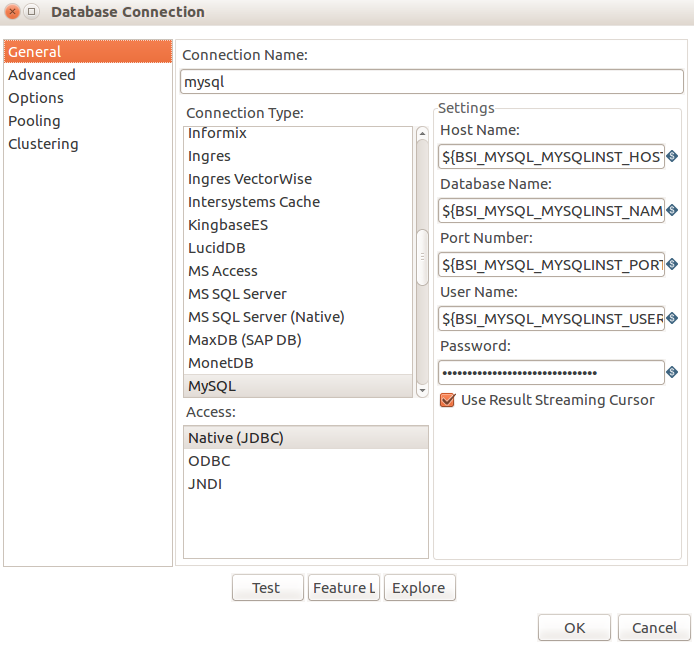
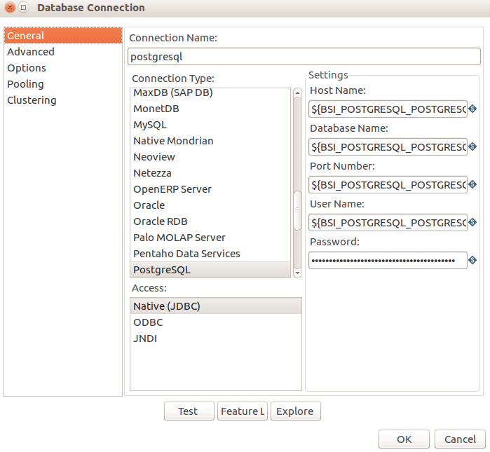

# Kettle绑定后端服务完成ETL任务
kettle是非常常见的开源ETL工具，提供了非常丰富的ETL组件，本例以kettle和mysql、postgreSQL后端服务为例，演示如何将kettle部署到datafoundry平台中，并绑定后端服务后，通过kettle的http任务执行器执行一个简单的ETL任务   

*  构建kettle镜像  
```   
  oc new-app https://github.com/datafoundry/kettle-service.git   
  oc expose svc kettle-service  
```  
* 创建MYSQL后端服务实例并绑定kettle   
```  
  oc new-backingserviceinstance mysqlinst \
  --backingservice_name=Mysql \
  --planid=56660431-6032-43D0-A114-FFA3BF521B66
  oc bind mysqlinst kettle-service
``` 
* 创建postgreSQL后端服务实例并绑定kettle
``` 
oc new-backingserviceinstance postgresqlinst  \
--backingservice_name=PostgreSQL \
--planid=bd9a94f2-5718-4dde-a773-61ff4ad9e843
oc bind postgresqlinst kettle-service
```   
*  查看kettle镜像中的一个ETL任务
trans1.ktr总体流程   
   
data_source节点配置   
    
data_dest节点配置   
    
*  通过kettle http任务执行器执行ETL任务
``` 
curl http://<kettle-service>.app.dataos.io/kettle/executeTrans/?trans=/trans1.ktr
``` 
从容器中可以看到ETL任务执行情况
```
datagrid@datagrid-MacBookPro:~/Downloads$ oc logs -f kettle-service1-5-ri04y
/data-integration
2016/05/21 12:18:59 - Carte - Installing timer to purge stale objects after 1440 minutes.
2016-05-21 12:18:59.131::INFO:  Logging to STDERR via org.mortbay.log.StdErrLog
2016/05/21 12:18:59 - Carte - Created listener for webserver @ address : 0.0.0.0:8181
2016-05-21 12:18:59.191::INFO:  jetty-6.1.21
2016-05-21 12:19:23.533::INFO:  Started SocketConnector@0.0.0.0:8181
2016/05/21 12:19:40 - trans1 - Dispatching started for transformation [trans1]
2016/05/21 12:19:42 - data_dest.0 - Connected to database [postgresql] (commit=1000)
2016/05/21 12:19:43 - prepare_data.0 - Finished reading query, closing connection.
2016/05/21 12:19:43 - prepare_data.0 - Finished processing (I=0, O=0, R=0, W=1, U=0, E=0)
2016/05/21 12:19:43 - data_source.0 - Finished reading query, closing connection.
2016/05/21 12:19:43 - data_source.0 - Finished processing (I=9, O=0, R=0, W=9, U=0, E=0)
2016/05/21 12:19:43 - Get Variables.0 - Finished processing (I=0, O=0, R=1, W=1, U=0, E=0)
2016/05/21 12:19:43 - create_dest_table.0 - Finished reading query, closing connection.
2016/05/21 12:19:43 - create_dest_table.0 - Finished processing (I=0, O=0, R=9, W=9, U=0, E=0)
2016/05/21 12:19:44 - data_dest.0 - Finished processing (I=0, O=9, R=9, W=9, U=0, E=0)
2016/05/21 12:19:44 - waiting_for_create_source_data.0 - Finished processing (I=0, O=0, R=1, W=1, U=0, E=0)
```
*  为kettle服务提供文件上传功能
```
oc new-build https://github.com/DataFoundry/simple-file-uploader.git
```

*  修改kettle服务DC配置，让kettle和文件上传服务一起运行
```
oc edit dc kettle-servic
```
在kettle服务dc配置的spec配置下增加如下内容:
```
    spec:
      volumes:
      - emptyDir: {}
        name: volume-tko1o
```
以上配置为kettle服务添加了一个卷，将用来为kettle服务和文件上传服务共享文件使用
在kettle服务dc配置的spec/containers配置项下添加如下内容：
```
    spec:
      containers:
      - image: 172.30.188.59:5000/yepeng/simple-file-uploader@sha256:dcab5ef91fc3b75159a0fc7534ecc16b8b94adf74f412f4c37d14e0f7c60d805
        imagePullPolicy: Always
        name: simple-file-uploader
        ports:
        - containerPort: 8000
          protocol: TCP
        resources: {}
        terminationMessagePath: /dev/termination-log
        volumeMounts:
        - mountPath: /simple-file-uploader/uploads
          name: volume-tko1o
      - image: 172.30.188.59:5000/yepeng/kttle-service
        imagePullPolicy: Always
        name: kettle
        resources: {}
        terminationMessagePath: /dev/termination-log
        volumeMounts:
        - mountPath: /trans
          name: volume-tko1o
```
在这里我们把kettle服务容器和文件上传服务容器运行在同一个POD中，然后通过一个卷来共享数据，这样通过文件上传服务上传的kettle配置文件就可以在kettle中被执行了。
